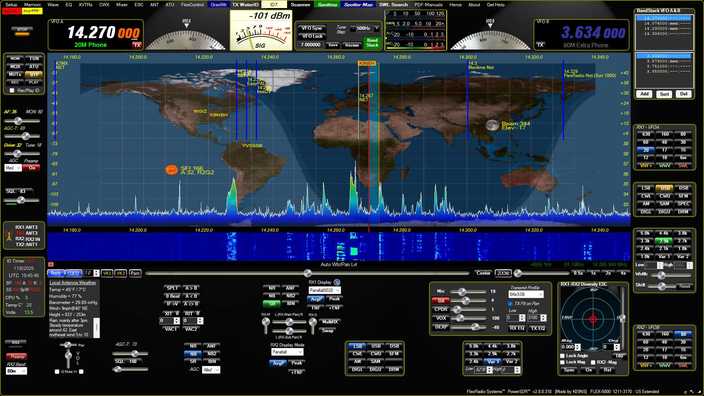

<!-- This makes the image show up beautifully on GitHub -->

   

    
  <b>PowerSDR KE9NS v2.8.0 SDR software for the Flex-1500, Flex-3000, and Flex-5000 radios</b>
   

# PowerSDR_KE9NS_v2.8.0

Based on the last version of FlexRadio PowerSDR v2.7.2

Ke9ns V2.8 is a highly modified version of that PowerSDR software

see https://ke9ns.com/revision.html for revision history since 2.7.2 Written in C# (PowerSDR), C (DttSP), C++(PowerMate)

Currently compiled under VS2022 (including C and C++ and C# modules) and .NET 4.8

IMPORTANT: To make sure this project will compile and run correctly, go to ke9sn.com/flexpage.html then download and install the full PowerSDR ke9ns v2.8.0 installer (Orange button)
This will make sure all DLLs and EXEs are in the correct locations ahead of time.

Then in Visual Studio, Clone this github project (https://github.com/ke9ns/PowerSDR_KE9NS_v2.8.0) 
You may need to upgrade the Toolset for "DttSP" and "PowerMate" projects

Set the "DttSP" and "powerMaate" properties: Configuration manager Release, Any CPU, and to build only PowerSDR (platform x86)
Set "PowerSDR" properties Build configuration = Release, Platform=x86
Set "PowerSDR" References->add reference->Project Solution->check the "PowerMate" but not the "DttSP". Click OK to close

Now open the installed PowerSDR folder: (C:\Program Files (x86)\FlexRadio Systems\PowerSDR v2.8.0) and COPY ALL the DLL's from here into the ..\bin\Relase\ folder for your project.
There are a bunch of DLLs that there is no soure code for and are not present in the github project.

You should now be able to hit the VS2022 "Start" button and run PowerSDR

NOTE: The DX Spotter world map (open up right side of Spotter window) is generated offsite and requires a headless browser (using Chrome).
This is located in a folder called: .local-chromium->Win64-848005->chrome-win->
due to size limitation of GITHUB, you will need to download chrome.dll to complete this install.
I will provide this on my website ke9ns.com/flexpage.html (just search for it)

Darrin Kohn KE9NS
